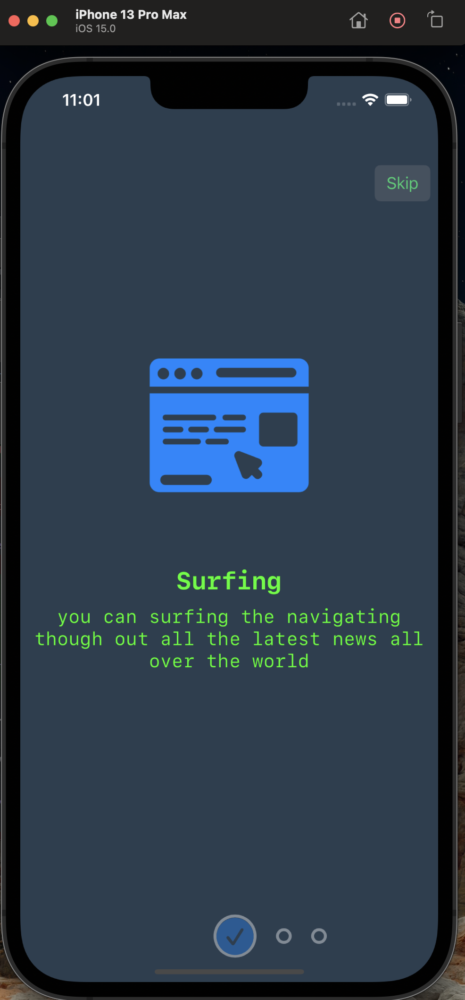
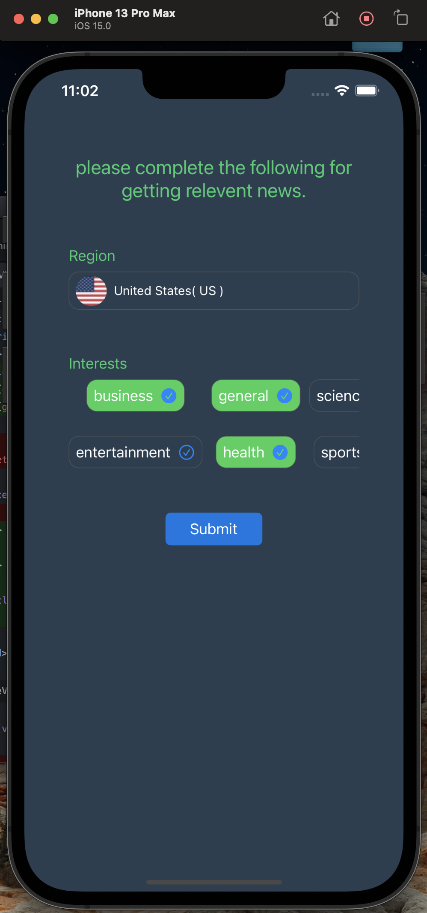
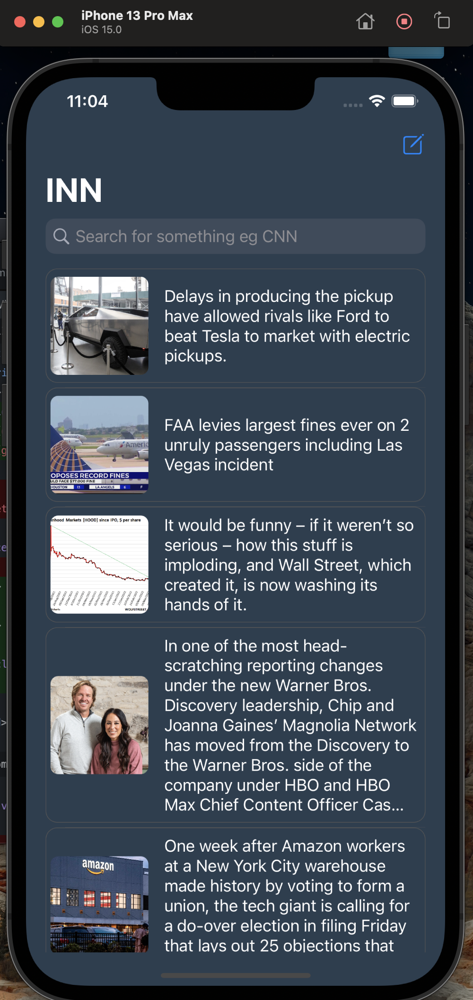
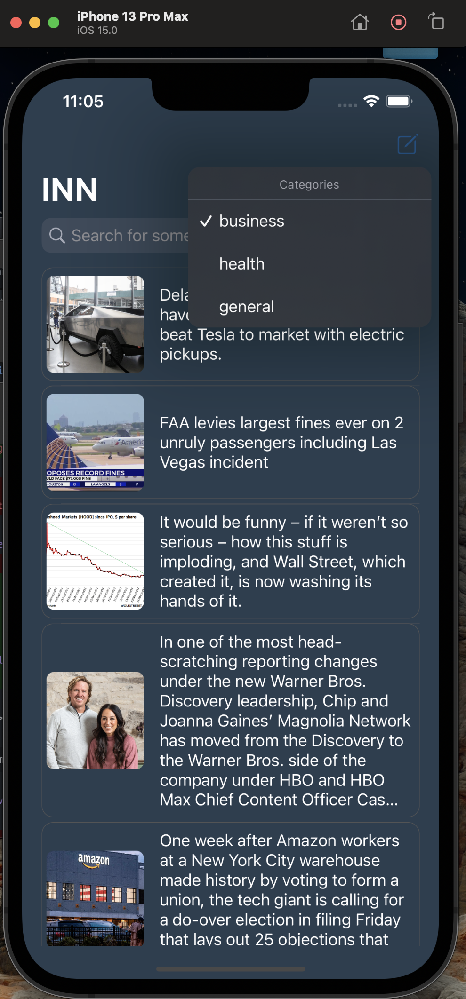
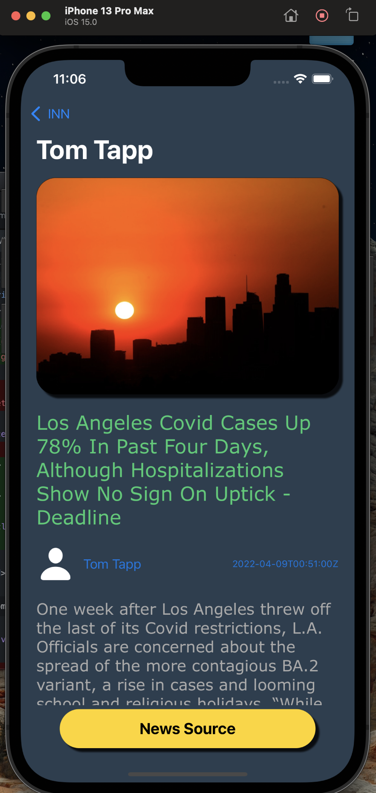

# MVVM_News
 
`
This repo is simulating a news prodcast application, it gives your your top news based on the region you are and what you are interested about
`

# ScreenShots
   |     | .  | .  | 


# Features
* it shows up a bunch of latest and updated news with the pagination for better performance and a very neat user interface
* it shows the details for every and each news item 
* it gives you the ability to search for whatever you want
* you can also navigate through the source of the news itself

# Tech
* swift 5
* POP (protocol oriented programming)
* MVVM with RxSwift
* FaÇade Design pattern on the Repository 
* Core Animation
* WKWebView


# 3<sup>rd</sup> parties libraries and tools
* RxSwift
* RxCoca
* SDWebImage
* Toast-Swift
* CountryPickerView
* Moya
* PaperOnBoarding
* Realm


# How To Build ?
* Clone repo
```
git clone https://github.com/Amin-0-1/MVVM_News
```
* run the project
```
open .xcworkspace
```
# Requirements
* Xcode 12.2 at least
* iOS 13+
* Swift 5
